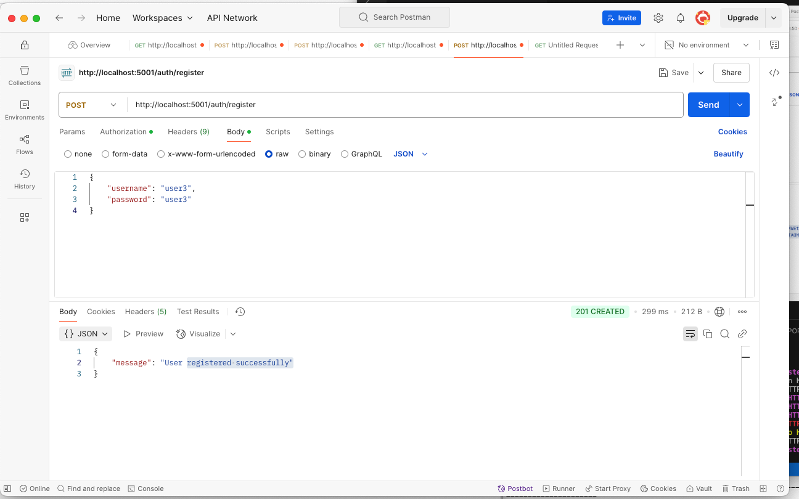
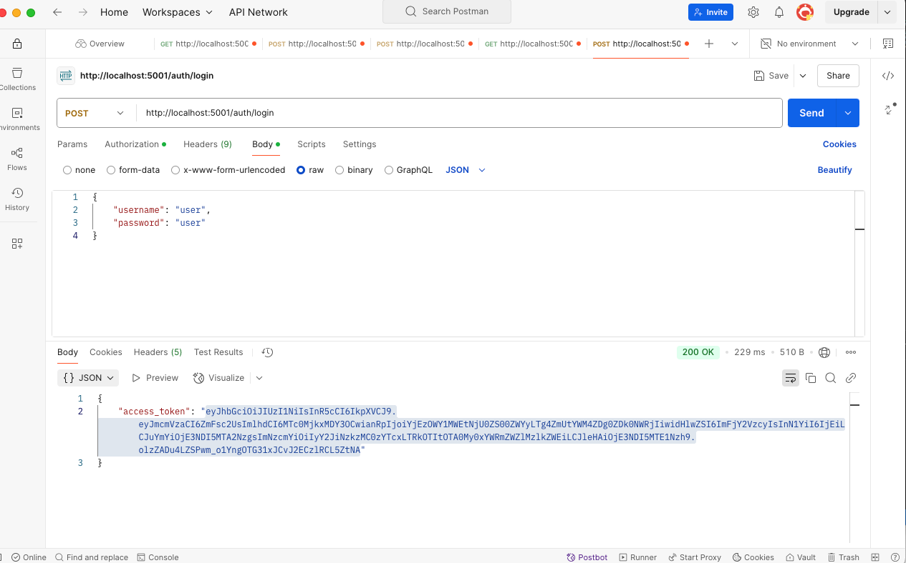
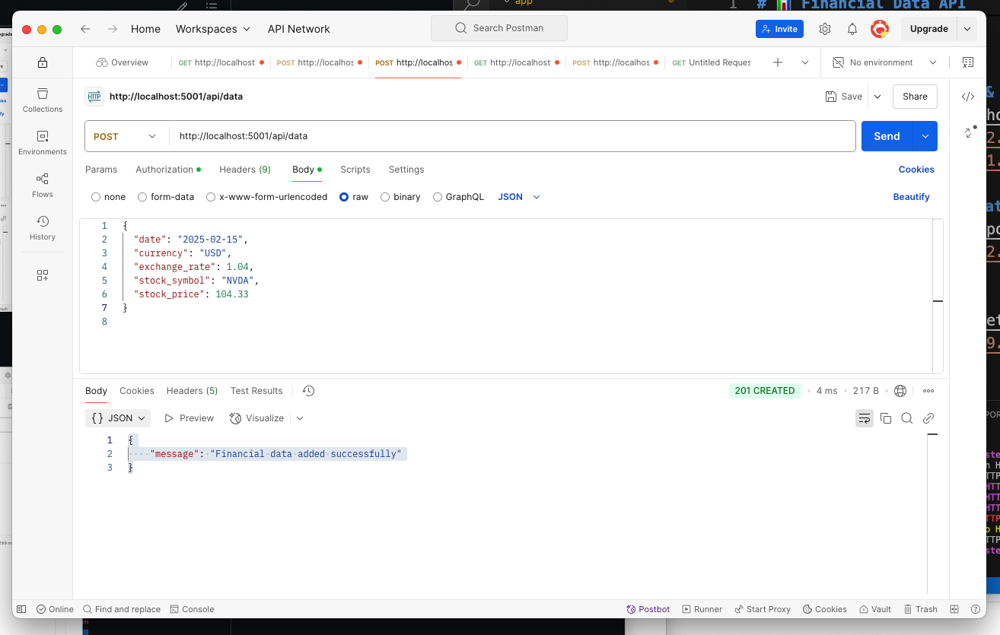
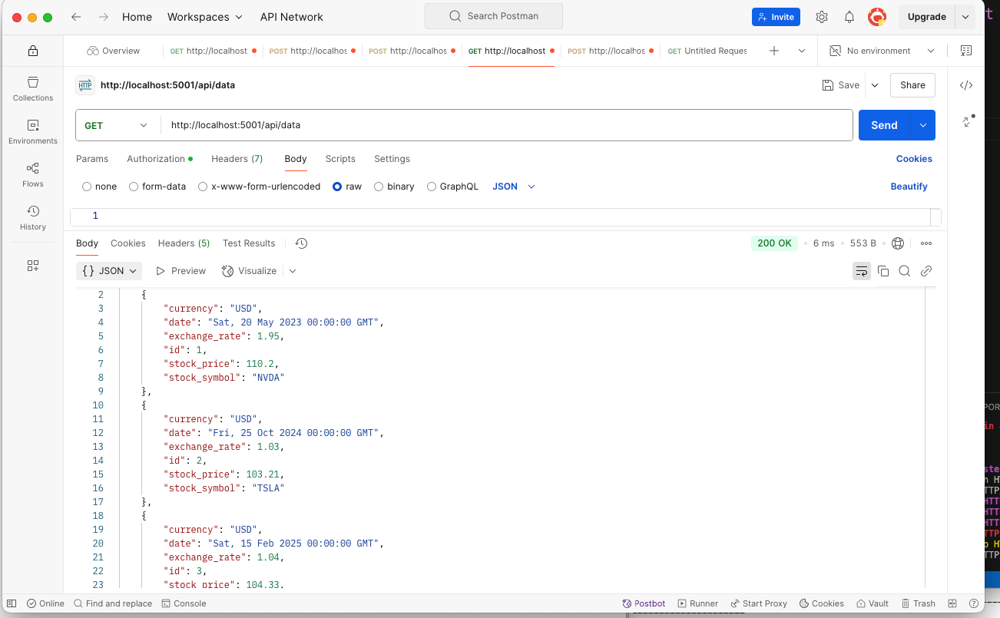

# 📊 Financial Data API

This is a **Flask-based REST API** for managing financial data, including exchange rates, stock prices, and currency details. The API allows users to **store, retrieve, and manage financial data** in a PostgreSQL database.

---

## 🚀 Features

✅ **User Authentication** – Uses JWT for secure access.  
✅ **CRUD Operations** – Create, Read, Update, and Delete financial data.  
✅ **PostgreSQL Database** – Persistent data storage with SQLAlchemy.  
✅ **RESTful API** – Clean and structured API endpoints.  

## Installation

### Prerequisites
- Python 3.8+
- PostgreSQL
- Virtual Environment (venv)


## 🛠 Tech Stack
- **Backend:** Flask, Flask-SQLAlchemy, Flask-JWT-Extended  
- **Database:** PostgreSQL  
- **Testing:** Unittest, Pytest  
- **API Testing Tool:** Postman  


### Setup Instructions
1. Clone the repository:
   ```bash
   git clone https://github.com/kw3ku/fin-api.git
   cd fin-api
   ```
2. Create and activate a virtual environment:
   ```bash
   python -m venv venv
   source venv/bin/activate  # On macOS/Linux
   venv\Scripts\activate  # On Windows
   ```
3. Install dependencies:
   ```bash
   pip install -r requirements.txt
   ```
4. Set up PostgreSQL database:
   ```sql
   CREATE DATABASE financial_data;
   ```
5. Configure environment variables:
   - Copy `.env.example` to `.env`
   - Update database connection details in `.env`
6. Initialize the database:
   ```bash
   flask db init
   flask db migrate -m "Initial migration"
   flask db upgrade
   ```
7. Run the application:
   ```bash
   python run.py
   ```

## API Endpoints

### Authentication
| Method | Endpoint       | Description        |
|--------|--------------|------------------|
| POST   | `/register`   | Register a new user |
| POST   | `/login`      | Authenticate user and return JWT |

### Financial Data
| Method | Endpoint            | Description             |
|--------|--------------------|-------------------------|
| GET    | `/api/data`        | Retrieve all financial data |
| POST   | `/api/data`        | Add a new financial record |
| GET    | `/api/data/<id>`   | Retrieve specific record by ID |
| PUT    | `/api/data/<id>`   | Update an existing record |
| DELETE | `/api/data/<id>`   | Delete a record |

## Testing
Run tests with:
```bash
pytest tests/
```

## Screenshots  

### ✅ User Registration & Login  
  



### ✅ Adding Financial Data  
 
 

### ✅ Fetching Data  
  



## Contributing
Feel free to open issues or submit pull requests.

## License
This project is licensed under the MIT License.

# Financial Data API


This is a Flask-based RESTful API...


